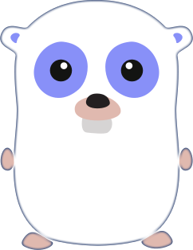

<p align="center">
    
</p>

<p align="center">

  <a href="https://github.com/steffen25/golang.zone-frontend/issues">
  	
  </a>

  <a href="http://nodejs.org/download/">
  	
  </a>

  <a href="https://golang.zone">
    
  </a>

  <a href="LICENSE.md">
  </a>

</p>


# golang.zone-frontend

Frontend for [https://golang.zone](https://golang.zone/)

Backend for [golang.zone-backend](https://github.com/steffen25/golang.zone)

## Build Setup

``` bash
# install dependencies
npm install
or
yarn install

# serve with hot reload at localhost:8080
npm run dev
or
yarn run dev

# build for production with minification
npm run build
or
yarn run build

# build for production and view the bundle analyzer report
npm run build --report
or
yarn run build --report
```

## CI

This project is configured with Github Actions in order to ease the CI process. At this moment we use the default nodejs workflow.

## Built With

* [VueJS](https://vuejs.org/) - The frontend framework used
* [Webpack](https://webpack.js.org/) - Bundling tool

## Authors

* **Robert Hansen** - [Robert-Hansen](https://github.com/Robert-Hansen)
* **Steffen** - [Steffen25](https://github.com/steffen25)

See also the list of [contributors](https://github.com/steffen25/golang.zone-frontend/graphs/contributors) who participated in this project.

## License

This project is licensed under the MIT License - see the [LICENSE](LICENSE) file for details